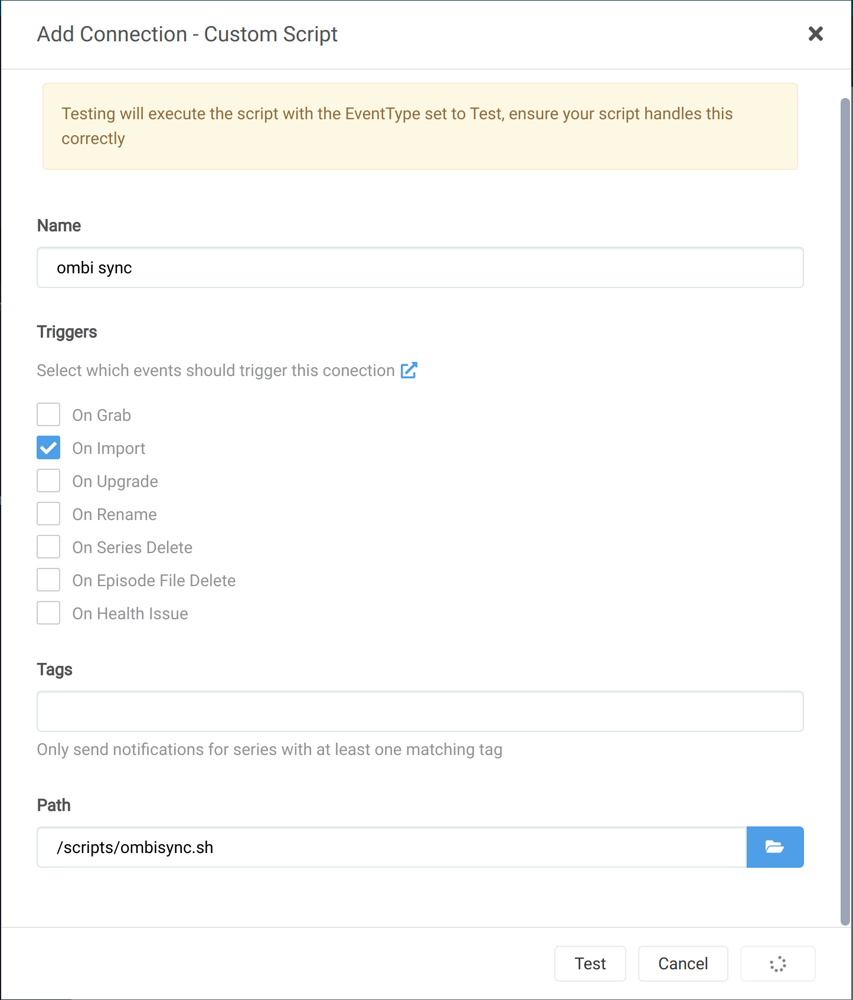

# OmbiSyncTrigger
Radarr/Sonarr custom script to trigger OmbiSync<-->Emby after import.

### About
By default Ombi blindly syncs with Emby every 5 mins past the hour. This means any new content could be sitting in your Emby library for up to an hour before Ombi sends you a notification.
This script ensures Ombi syncs with Emby immedietely after each successful Radarr/Sonarr import.

Could be easiely adapted for Plex.

## Requirements
* Radarr/ Sonarr (dockers)

## Usage
* Remember to give script executable permissions
* Edit the 2 fields within the script for your Ombi Base URL and APIKey.
* Ensure the script is mountable inside your containers
* Add the script within Radarr or Sonarr settings/connections

## 2 Important Things
* For most people that have linked Emby->Radarr/Sonarr it will trigger an Emby Library Update upon successful import. However, it still takes Emby some time to actually find any new content (usually < 30 secs depending on library). It's therefore important that when this script runs Emby has already successfully recognized the new content. As a prevenative measure I've included a sleep of 60 seconds on the script. You can shorten or lengthen this if needed. 
* When you add the script to Radarr/Sonarr, as soon as you click 'save' or 'test' it will run the entire script before continuing - including the default 60 second wait!. So you'll just have to wait.

